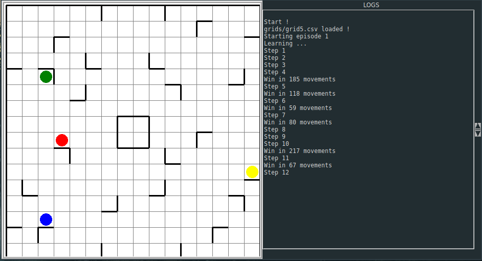

# REINFORCEMENT RICOCHET ROBOT (3R)



Ce projet tente d'utiliser l'apprentissage par renforcement pour résoudre des grilles de ricochet robot.
Les méthodes d'apprentissage par renforcement utilisées sont le qlearning et le deep qlearning.

Plusieurs uses cases sont prévues :

* Visualiser une grille
* Apprendre un nouveau modèle sur une ou plusieurs grille(s)
* Continuer l'apprentissage d'un modèle
* Utiliser un qlearning ou un deep qlearning déjà appris sur une grille
* Créer de nouvelles grilles (opération manuelle)

## Pré-requis

Pour utiliser le programme, vous aurez besoin de quelques pré-requis :

* Avoir python3 avec tkinter installé.
* Avoir pip3 installé.
* Optionnel : avoir pipenv d'installer

## Installation

Sans pipenv

```bash
pip3 install -r requirements.txt
```

Avec pipenv

```bash
pipenv install
```

## Utilisation

### Visualiser une grille

```bash
python3 main.py show path/to/grid.csv
```

### Apprendre un nouveau modèle

```bash
python3 main.py learn --output path/to/output path/to/grid.csv
```

### Continuer l'apprentissage d'un modèle

```bash
python3 main.py learn --input path/to/model --output path/to/output path/to/grid.csv
```

### Utiliser un modèle déjà appris

```bash
python3 main.py play path/to/model path/to/grid.csv
```

## Créer vos grilles

Créer une grille de jeu est simple, il suffit de créer un `.csv` en suivant les quelques explications ci-dessous.

### Les connaissances de base

Ces connaissances sont liées aux caractéristiques du jeu et sont les suivantes :

* La taille de la grille est de 16x16
* Il existe obligatoirement 4 pions de 4 couleurs différentes (rouge, jaune, vert, bleu)
* Il existe 4 positions de murs possibles (haut, bas, gauche, droite) normalement seules certaines combinaisons de murs sont possibles (haut-gauche, haut-droit, bas-gauche, bas-droit) mais cette implémentation permet plus de flexibilité
* Seule une case de fin est possible pour chaque grille, elle doit être de la couleur d'un des points

Maintenant que vous connaissez les bases de la construction d'une grille de jeu, nous allons voir comment mettre en place ces éléments dans le fichier `.csv`.

### Le codage des éléments

Chaque élément est associé à un nombre. Si plusieurs éléments sont disposés sur la même case alors il suffit d'additionner les nombres.

Voici la liste des codes associés à chaque élément :

* Mur gauche : 1
* Mur droit : 2
* Mur haut : 4
* Mur bas : 8
* Pion rouge : 16
* Pion bleu : 32
* Pion vert : 64
* Pion jaune : 128
* Fin rouge : 256
* Fin bleue : 512
* Fin verte : 1024
* Fin jaune : 2048

### Exemple de grille

Voici donc un exemple de grille :

```csv
5,4,4,6,4,4,4,4,6,4,4,4,4,4,4,6
1,0,0,0,0,2,8,0,0,0,0,0,10,0,0,2
1,8,0,0,0,0,0,0,0,2,8,0,0,0,0,2
129,2,0,0,0,8,0,0,0,0,0,0,0,0,0,10
1,0,0,0,2,0,0,0,0,0,0,8,0,0,0,2
1,0,10,0,0,0,0,10,0,0,0,2,0,0,8,2
9,0,0,0,0,0,0,8,8,0,0,0,0,2,0,2
1,0,0,0,0,0,2,0,2,2,8,0,0,0,0,2
1,0,0,8,0,0,2,8,10,0,0,0,0,0,0,2
1,0,0,258,0,0,0,0,0,0,0,0,0,2,8,2
1,0,0,0,0,32,0,0,0,10,0,0,8,0,0,2
3,8,0,0,0,0,0,0,0,0,0,2,0,0,0,10
1,0,0,0,16,0,10,0,8,0,0,0,0,0,64,2
9,0,8,0,0,0,0,2,0,0,8,0,0,0,0,2
1,2,0,0,0,0,0,0,0,0,2,0,0,0,0,2
9,8,8,8,8,10,8,8,8,8,8,8,10,8,8,10
```

## Améliorations possibles

* Un créateur de grille simplifié
* Implémentation d'autres algorithmes d'apprentissage par renforcement
